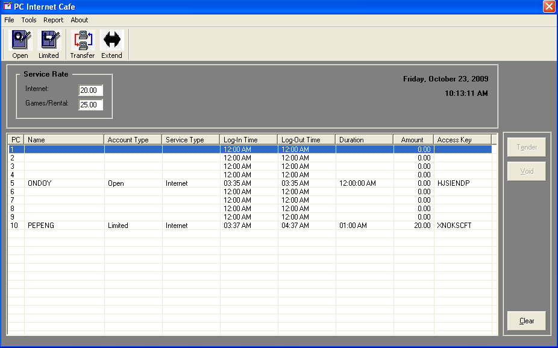



## Internet Cafe' \- Server and Client

### Description

it's a internet cafe' rental system, that monitor's user time-in and lapse time... good for small computer shop.... it also monitor your daily revenue's... FREE TO VOTE THIS CODE!!!
 
### More Info
 
server and client connection using mySQL database and VB6.0 programming

             |
---                |---
**Submitted On**   |2009-10-11 09:52:32
**By**             |[Walter Toledo](https://github.com/Planet-Source-Code/PSCIndex/blob/master/ByAuthor/walter-toledo.md)
**Level**          |Intermediate
**User Rating**    |4.3 (13 globes from 3 users)
**Compatibility**  |VB 6\.0
**Category**       |[Complete Applications](https://github.com/Planet-Source-Code/PSCIndex/blob/master/ByCategory/complete-applications__1-27.md)
**World**          |[Visual Basic](https://github.com/Planet-Source-Code/PSCIndex/blob/master/ByWorld/visual-basic.md)
**Archive File**   |[Internet\_C21658410222009\.zip](https://github.com/Planet-Source-Code/walter-toledo-internet-cafe-server-and-client__1-72582/archive/master.zip)

